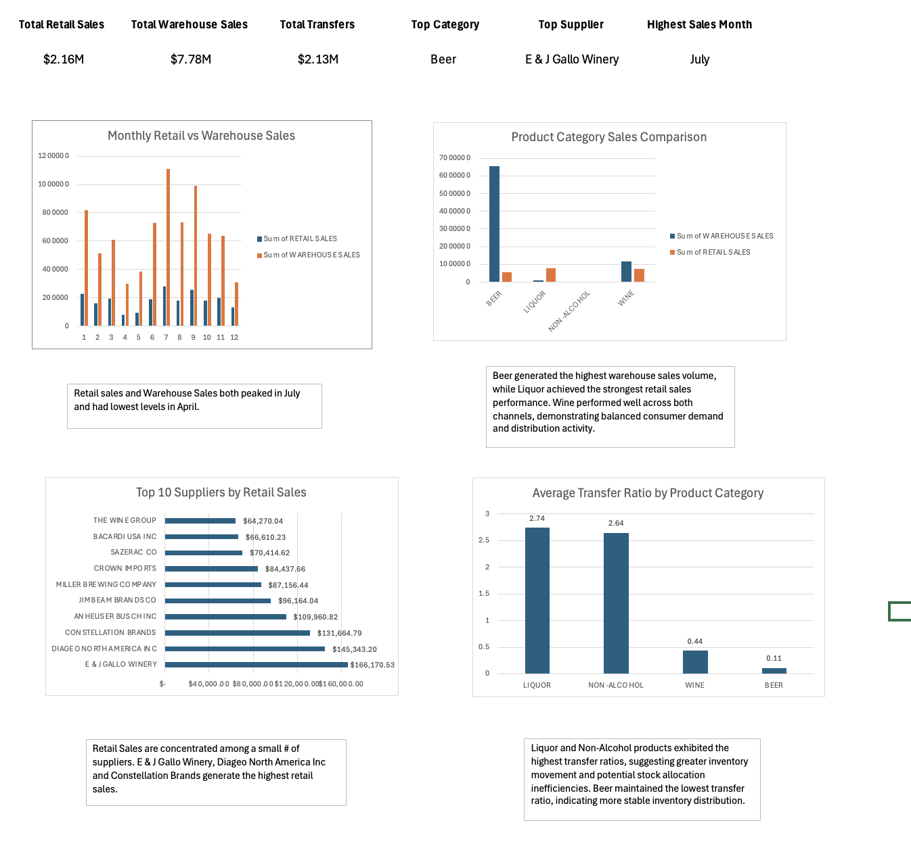

# retail-sales-inventory-dashboard
Built an Excel dashboard analyzing retail sales, warehouse activity, supplier performance, and inventory transfer efficiency.
## Dashboard Preview

Tools Used

* Microsoft Excel
* PivotTables
* PivotCharts
* KPI Dashboard
* Data Visualization

Key Analyses

* Monthly Retail vs Warehouse Sales
* Product Category Performance
* Top 10 Supplier Analysis
* Inventory Transfer Ratio Analysis

Key Findings

* Beer generated the highest warehouse sales volume.
* Liquor had the strongest retail sales performance.
* July was the highest-performing sales month.
* E & J Gallo Winery was the top retail supplier.
* Liquor and Non-Alcohol had the highest transfer ratios.

Files

* Retail_Sales_Inventory_Analytics_Dashboard.xlsx
* dashboard-preview.png
